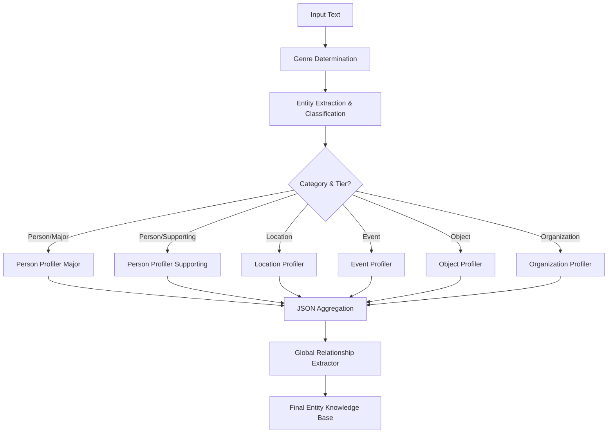

# Entity Mining Workflow Plan

This plan outlines the design of an "Entity Mining" workflow for a Fiction Novel Writing Agent. The workflow processes text (like `stories/nadarr_prologue.txt`) to extract, classify, and detail entities (Persons, Locations, Events, Objects, Organizations) to populate a knowledge base.

## Workflow Architecture

The workflow will be implemented as a sequential chain of LLM calls.



## Prompt Templates

The following prompt templates define the behavior of the agent at each step.

### 1. Genre Determination

**Goal**: Identify the genre context.

**Template**:

```text
Analyze the following text and determine its specific fiction genre.
Consider the setting, tone, technology level, and character archetypes.
Explain your reasoning briefly, then provide a concise Genre Label.

Text: {text}

Output Format:
Reasoning: ...
Genre: ...
```

### 2. Entity Extraction & Classification

**Goal**: Identify entities, categorize them, and determine their narrative significance.

**Template**:
```text
You are an expert editor. Read the text below and extract all named entities.
1. Classify each entity into: "Person", "Location", "Event", "Object", "Organization", "Other".
2. Determine Significance:
   - "Major": deeply involved in the scene, driving action, or detailed heavily.
   - "Supporting": significant interaction or role, but not a central focus.
   - "Minor": mentioned in passing, background, or lacks agency.

Context/Genre: {genre}
Text: {text}

Output as a JSON list of objects:
[
  {"name": "Entity Name", "category": "...", "significance": "Major/Supporting/Minor"},
  ...
]
```
*Note: "Major" entities get full Profiling. "Supporting" entities get a lighter pass (Role + Key Trait + Voice). "Minor" entities are stored with a minimal summary.*

### 3. Person Profiler (Major & Supporting Entities)

**Goal**: Extract detailed character attributes without hallucinating missing details.

**Reasoning Strategy**:
1.  **Evidence Priority**: Prioritize what is *explicitly written*.
2.  **Trait vs. State**: Distinguish between how they act *now* (Internal State) and who they *are* (Personality).
3.  **Null Tolerance**: If a field (like History) is not mentioned, explicitly acknowledge it is Unknown.
4.  **Voice Analysis**: Analyze dialogue (if any) to determine speech patterns.

**Template**:
```text
You are a character profiler. Analyze the character "{entity_name}" based ONLY on the text provided.
Significance Level: {significance}

Reasoning Steps:
1. Identify explicit physical details vs. genre assumptions.
2. Distinguish between temporary emotions (State) and permanent traits (Personality).
3. Analyze dialogue for Voice/Style.
4. Identify what is NOT known (gaps).

Context/Genre: {genre}
Text: {text}

Return a JSON object. Use `null` if the text contains no evidence for a field.
{
  "name": "{entity_name}",
  "titles_and_nicknames": ["..."],
  "role": "Protagonist/Antagonist/Supporting/etc.",
  "physical_description": "...",
  "history": "...",
  "personality": "...",
  "voice_style": "Describe speech patterns, formality, slang, etc.",
  "motivations": "...",
  "strengths": "...",
  "flaws": "...",
  "long_term_goals": "...",
  "short_term_goals": "...",
  "current_internal_state": "..."
}
```
*For "Supporting" characters, instructions will guide the LLM to be concise and allow more nulls.*

### 4. Location Profiler (Major Only)

**Goal**: Extract detailed location attributes.

**Reasoning Strategy**:
1.  **Sensory & Atmosphere**: What are the defining sights, sounds, and smells? What mood does this place evoke?
2.  **Geography & Layout**: How is the space organized? Is it cramped, vast, vertical?
3.  **History & Purpose**: What was this place used for? How has time affected it (ruins, pristine)?
4.  **Significance**: Why does the story take place here?

**Template**:
```text
You are a setting designer. Based on the text provided and the genre context, analyze the location "{entity_name}".

Reason through these points first:
1. What are the dominant sensory details?
2. How does the history of the place manifest in its current appearance?
3. What is the emotional atmosphere?

Context/Genre: {genre}
Text: {text}

Return a JSON object with the exact keys below. Use `null` if unknown.
{
  "primary_name": "{entity_name}",
  "secondary_name": "...",
  "description": "...",
  "history": "...",
  "prominent_entities_associated": ["List of names..."]
}
```

### 5. Event Profiler (Major Only)

**Goal**: Extract detailed event attributes.

**Reasoning Strategy**:
1.  **Causality**: What triggered this event?
2.  **Sequence**: How did it unfold (beginning, middle, end)?
3.  **Impact**: What changed immediately after? What are the potential long-term consequences?
4.  **Key Players**: Who shaped the outcome?

**Template**:
```text
You are a historian of this fictional world. Based on the text provided and the genre context, analyze the event "{entity_name}".

Reason through these points first:
1. What was the inciting incident?
2. How did the event alter the status quo?
3. Who were the key agents of change?

Context/Genre: {genre}
Text: {text}

Return a JSON object with the exact keys below. Use `null` if unknown.
{
  "primary_name": "{entity_name}",
  "secondary_name": "...",
  "description": "...",
  "prominent_entities_associated": ["List of names..."]
}
```

### 6. Object Profiler (Major Only)

**Goal**: Extract detailed object/artifact attributes.

**Reasoning Strategy**:
1.  **Physicality**: Material, craftsmanship, condition (weathered, new).
2.  **Function/Magic**: What does it do? If magical, what are the rules/costs?
3.  **Provenance**: Where did it come from? Who made it?
4.  **Bond**: What does it mean to its owner?

**Template**:
```text
You are a Loremaster. Based on the text provided and the genre context, analyze the object "{entity_name}".

Reason through these points first:
1. Visual and tactile details (material, weight, glow).
2. Mechanics of its function or magic.
3. Emotional or historical significance to the wielder.

Context/Genre: {genre}
Text: {text}

Return a JSON object with the exact keys below. Use `null` if unknown.
{
  "name": "{entity_name}",
  "type": "Weapon/Artifact/Tool/etc.",
  "description": "...",
  "history": "...",
  "magical_properties": "...",
  "owner": "Name of owner if known"
}
```

### 7. Organization Profiler (Major Only)
**Goal**: Extract detailed attributes for groups, factions, or organizations.
**Reasoning Strategy**:
1.  **Purpose**: Why does this group exist? (Commerce, War, Religion).
2.  **Structure**: Is it hierarchical, loose, secretive?
3.  **Reputation**: How are they perceived by outsiders vs insiders?
4.  **Key Members**: Who leads or represents them?

**Template**:
```text
You are a Political Analyst. Based on the text provided and the genre context, analyze the organization "{entity_name}".

Reason through these points first:
1. What is their stated goal vs actual behavior?
2. How do they operate (overtly/covertly)?
3. Who are the visible faces of the group?

Context/Genre: {genre}
Text: {text}

Return a JSON object with the exact keys below. Use `null` if unknown.
{
  "name": "{entity_name}",
  "type": "Guild/Army/Cult/Government/etc.",
  "description": "...",
  "history": "...",
  "goals": "...",
  "prominent_members": ["List of names..."]
}
```

### 8. Global Relationship Extractor

**Goal**: Analyze dynamics between all Major entities to ensure consistency.

**Template**:
```text
You are a Relationship Mapper. Analyze the interactions between the following Major Entities: {top_k_names}.

Identify all explicit relationships, alliances, and conflicts present in the text.

Context/Genre: {genre}
Text: {text}

Return a JSON list:
[
  {
    "source": "Name A",
    "target": "Name B",
    "relation_type": "Sibling/Enemy/Superior/etc.",
    "dynamics": "Description of their interaction..."
  },
  ...
]
```

## Implementation Steps

1.  **Define Pydantic Models**: Create strict schema definitions for `Person`, `Location`, `Event` , `Object`, `Organization` to ensure consistent JSON output.
2.  **Implementation**: Create the logic in `backend/lambda/entity_miner.py` to orchestrate these calls.
